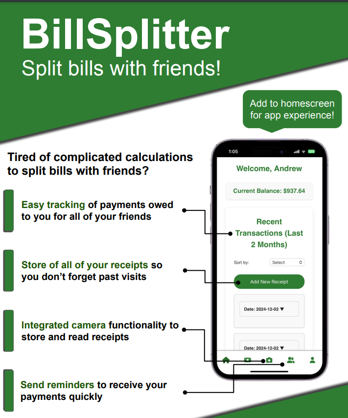

# BillSplitter

## Overview

BillSplitter is a mobile application designed to simplify the process of splitting bills among friends. Built with React Native and deployed as a Progressive Web App (PWA), BillSplitter makes it easy to keep track of shared expenses, scan receipts, itemize purchases, and request payments.

## Key Features

*   **Easy Bill Splitting:** Tired of complicated calculations? BillSplitter allows you to effortlessly divide expenses among your friends.

*   **Optical Character Recognition (OCR):** The integrated camera functionality allows you to scan receipts, and the app uses OCR to itemize the purchases automatically.

*   **Payment Tracking:** Keep track of payments owed to you by your friends, ensuring that you get paid quickly and easily.

*   **Receipt Storage:** Store digital copies of your receipts, so you can easily view past transactions at any time.

*   **Friend Management:** Add friends directly within the app, making it simple to manage group expenses.

*   **Payment System Integration:** Connect different payment systems for seamless payments, so you can send and receive money with ease.

*   **Mobile Friendly PWA:** As a Progressive Web App, BillSplitter can be accessed via a browser on any device, providing a smooth app-like experience with the added option to install it to your home screen.

*   **Payment Reminders:** Send reminders to friends to receive your payments quickly so you are not waiting on funds.

## How it Works

1.  **Capture a Receipt:** Use the built-in camera functionality to scan a receipt.
2.  **Itemize Purchases:** The app's OCR will automatically identify the items and prices on the receipt.
3.  **Assign Items to Friends:** Easily assign specific items to different friends or split the entire bill evenly.
4.  **Track Payments:** BillSplitter automatically keeps track of who owes what, so you don't have to.
5.  **Send Reminders:** Remind your friends to send you money.
6. **Connect Payment Systems:** Connect your favorite online payment system to streamline transfers.

## Technology Stack

*   **Frontend:** React Native (for PWA compatibility)
*   **OCR:** Integrated Optical Character Recognition
*   **Payment System:** Adaptable to integrate with various payment systems.

## Installation (PWA)

1.  Open your browser on your mobile device.
2.  Visit the deployed BillSplitter application's web address.
3.  You may be prompted to "Add to Home Screen" or "Install" for an app-like experience.

## Usage

*   After setting up your account, add friends that you commonly split bills with.
*   When at a restaurant or after a shared purchase, scan your receipt.
*   Distribute costs and send payment requests to the appropriate friends.

## Contributing

We welcome any contributions to the project! Please feel free to open issues, submit pull requests, and provide feedback.

## License

This project is open source. Please feel free to use, modify and contribute to the codebase!
